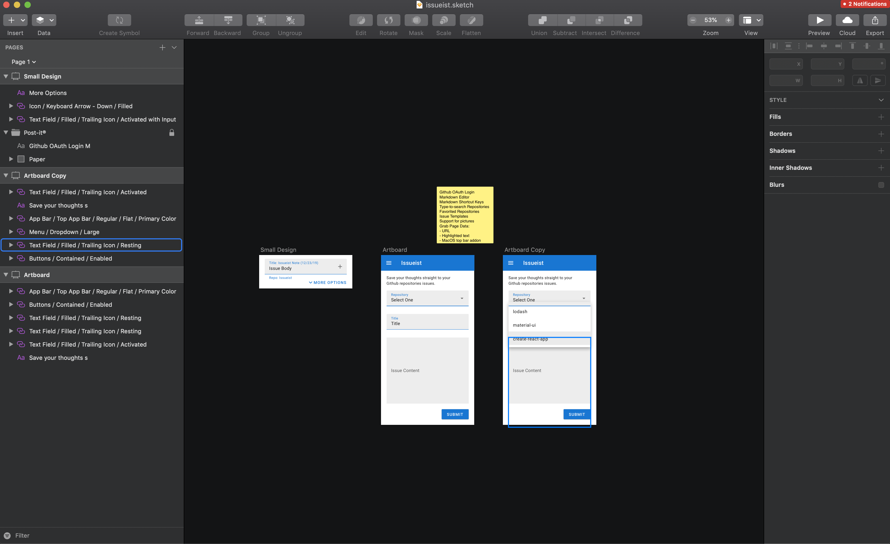

Improving your productivity is a lifelong journey. I find myself in a constant cycle of buy-and-try with different methods in the hopes of doing so. As a developer I find I spend most of my time on [Github](https://github.com/). By doing so I've developed techniques to improve my productivity on the platform, with GH issues lying at the crux. That's when I realized I needed a tool like Issueist.

<!--truncate-->

I like to keep notes on everything. I live in constant fear that the good ideas that I have and find online will be lost to memory leakage over time. In an effort to prevent this from happening I have notes everywhere. I keep notes about different articles on Google Keep. Meeting notes, and general ideas usually fall into the native notekeeping program of my OS. What is my method for deciding which note is categorized there? Random chance. However, a common denominator is most of these notes have some relation to technology and code. Eventually, I usually open up Github and make a repo or an issue in an idea repo I've created based on a note, or set of notes, I've taken over time.

*Photo by Min An from Pexels*

That's when I realized it could be better. What if I had an application where I didn't need to navigate to Github on my browser, find (or create) a repo, open up a new issue, format it all, and then write it up. I could just use a browser extension or native application and post straight to the repository I wanted. Surely there was something out there that I could use. Nope, I couldn't find it. So I decided to make it.

So I went around and looked at different successful todo applications, learning some good UX patterns, opened up [Sketch](https://www.sketch.com/), prototyped, and developed a simple form that could submit issues to the GH repo of your choice. Just like that I had what I needed.

To develop fast, I used the design library for [Material](https://www.sketchappsources.com/free-source/874-material-design-google-sketch-freebie-resource.html) and [Material-UI](https://material-ui.com) for web components. I made it in the tried and true [Create React App](https://github.com/facebook/create-react-app) boilerplate and used javascript libraries like [Github.js](http://github-tools.github.io/github/docs/3.1.0/index.html) to connect to their API. I then published all the work on the [Issueist GH Repo](https://github.com/kaufmann42/issueist), for the community to help with development.

I wanted to share my application with others so I made a website using [Docusaurus](https://docusaurus.io) went through to post it in some places using an [Awesome Places To Post Your Startup](https://github.com/mmccaff/PlacesToPostYourStartup) list.

And just like that, Issueist was born.
